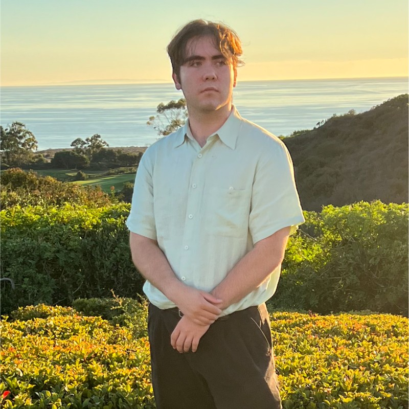

## Christopher Schrader

### About:
Hey there! My name is Christopher Schrader. I'm a 3rd-year Computer Science student studying at **UC San Diego**. Briefly, here are a few things about me:
- I am from **Orange County**, California
- I am **22 years old**
- Some hobbies of mine include hiking and playing video games, namely Overwatch 2.
- I have a dog named Jenna, whom I love very much. Here's a [picture](jenna.jpg) of her.

My main interest is in web programs, namely _Node.js_ projects, although I do have experience working with other languages and technologies. Here are my favorite languages and frameworks that I have experience in, ranked by how much experience I have in them:
1. HTML/CSS/Javascript
2. Node.js
3. C++
4. Java
5. SwiftUI

I'm also really into music! I play the piano, guitar, and bass, and love indulging in new sounds. Here's aquote from one of my favorite songs, _Siberian Breaks_ by _MGMT_:
>If you find the soul that you lost \n
>Frozen in a starry void
>Take it within and hope the sight of blood
>Can will signs of life to return
>Back to the way that it was
>Long before it made a noise
>To keep on quietly reminding you
>What's never created or destroyed

### Contact:
- chrisbuddy29@gmail.com
- 949-573-3469
- cwschrader@ucsd.edu
- [LinkedIn](https://www.linkedin.com/in/christopher-schrader-3a9b84127/)

### Projects:

